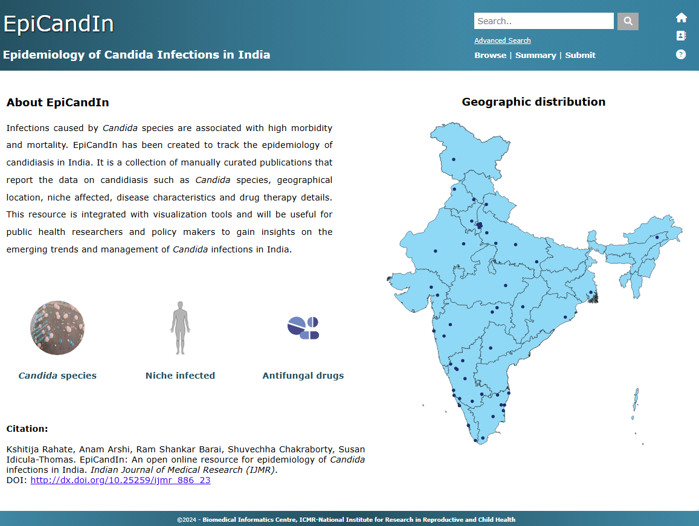

# EpiCandIn

EpiCandIn is a curated database of epidemiology infections in India. It contains data on species, niche infected, infection prevalence, antifungal susceptibility profiles, and more from studies published between 1972 and 2022.

## Features
- Detailed infection data by species and niche
- Antifungal susceptibility profiles
- Data curated from multiple published studies
- User form to submit new study data

## Explore the Project

Visit the project on GitHub: [EpiCandIn Repository](https://github.com/your-username/your-repo)

## Screenshots

---

## How to Use

1. Visit the link:
https://epicandin.bicnirrh.res.in/

2. Explore the data and documentation
3. Use the submission form to add new studies

---

## Citation

If you use data or reference from this study, please cite it as follows:

Kshitija Rahate, Anam Arshi, Ram Shankar Barai, Shuvechha Chakraborty, Susan Idicula-Thomas. EpiCandIn: An open online resource for epidemiology of Candida infections in India. Indian Journal of Medical Research (IJMR). ​
DOI: [EpiCandIn doi](http://dx.doi.org/10.25259/ijmr_886_23)

---

## License

MIT License

---

